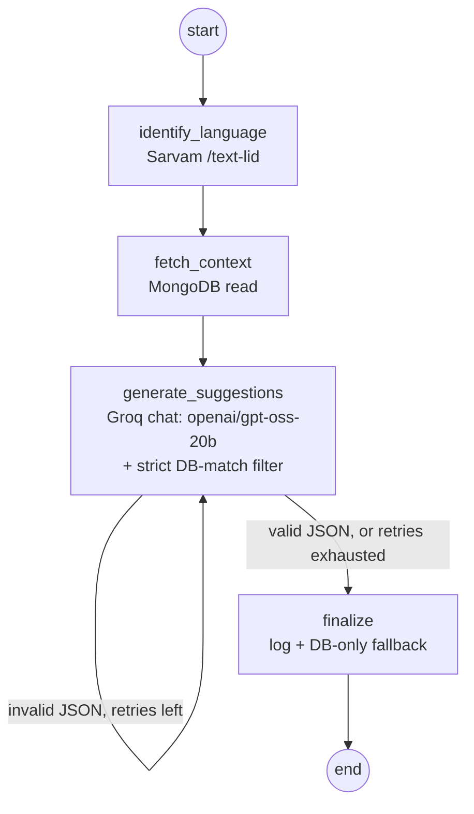

# GlobeTrotter AI Suggestions Service

A standalone FastAPI + LangGraph microservice that turns a free-text prompt ("suggest a
3-day budget trip to Goa") into structured trip suggestions, grounded **strictly** in the
same MongoDB catalog (`cities`, `activities`, `trips`, `stops`) the Node backend already
uses — every suggestion the model returns is checked against the database and dropped if
it isn't a real catalog entry — and answered in whatever language the user typed in, via
[Sarvam AI](https://sarvam.ai) for language detection and [Groq](https://groq.com)
(`openai/gpt-oss-20b`) for generation.

## Why a separate service

- Different runtime (Python, for LangGraph + the LLM/ML ecosystem) vs. the Node backend.
- Ships and iterates independently — no risk of merge conflicts with teammates working in
  `backend/` or `frontend/`.
- Reads the same Atlas database read-only for grounding, and only ever *writes* to its own
  `ai_suggestion_logs` collection — additive, never touching the Mongoose-owned collections.

## Architecture

```
AI/
├── app/
│   ├── main.py                FastAPI app + CORS
│   ├── config.py              env-driven settings (pydantic-settings)
│   ├── db.py                  Motor (async MongoDB) — reads cities/activities/trips/stops
│   ├── sarvam_client.py       Sarvam language-ID call (/text-lid)
│   ├── groq_client.py         Groq chat model (OpenAI-compatible) for generation
│   ├── schemas.py             request/response models
│   ├── routes/suggestions.py  POST /api/v1/suggestions, GET /api/v1/health
│   └── graph/
│       ├── state.py           LangGraph state (TypedDict)
│       ├── nodes.py           node implementations
│       └── build.py           StateGraph wiring — the source of truth for the diagram below
├── scripts/generate_diagram.py   regenerates diagrams/state_diagram.mmd from the real graph
├── diagrams/state_diagram.mmd
└── frontend/                  plain HTML/CSS/JS demo UI (no build step)
```

### Request flow (LangGraph)

1. **identify_language** — calls Sarvam's Language Identification API (`/text-lid`) on the
   raw prompt to detect language + script (e.g. `hi-IN` / `Deva`). Defaults to English on
   any failure so this step can never break the request.
2. **fetch_context** — pulls grounding data from MongoDB: the trip's existing stops/budget
   if a `trip_id` was given, plus a text-search of the `cities` and `activities` catalogs
   against the prompt.
3. **generate_suggestions** — calls Groq's chat completion API (model `openai/gpt-oss-20b`
   by default, configurable) through `langchain_openai.ChatOpenAI` pointed at Groq's
   OpenAI-compatible endpoint. The model is instructed to answer *in the language detected
   in step 1* and to return strict JSON, choosing suggestions **only** from the cities/
   activities handed to it in the context — never inventing a destination or activity.
   That instruction is not trusted on its own: the code then checks every returned
   `title` against the catalog entries fetched in step 2 (case-insensitive exact match)
   and drops anything that doesn't match, overwriting `type`/`estimatedCost` with the real
   database values rather than whatever the model claimed. If nothing survives that check,
   it falls back to catalog entries directly, with no LLM text at all.
4. **Conditional edge** — if the model's output doesn't parse as JSON, the graph loops back
   into `generate_suggestions` once more before giving up (`retry_count`), rather than
   failing the whole request on a single bad generation.
5. **finalize** — logs the prompt + result to `ai_suggestion_logs` (fire-and-forget
   analytics, this service's own collection) and returns the response. If generation still
   has no usable output after retries, it builds the response straight from the fetched
   catalog entries — the response is never anything other than real database rows.

### State diagram



Regenerate this from the actual compiled graph any time the code changes:

```bash
python scripts/generate_diagram.py
```

That writes `diagrams/state_diagram.mmd` (always) and `diagrams/state_diagram.png` (if it
can reach the Mermaid render service).

## Setup

Requires Python 3.11+.

```bash
cd AI
python -m venv .venv
.venv\Scripts\activate          # Windows
# source .venv/bin/activate     # macOS/Linux

pip install -r requirements.txt
copy .env.example .env          # Windows; `cp` on macOS/Linux
```

Fill in `AI/.env`:

- `MONGO_URI` / `MONGO_DB_NAME` — point at the **same** Atlas cluster + `globetrotter`
  database as `backend/.env`. This service only reads the catalog collections and writes
  its own log collection, so sharing the DB is safe.
- `SARVAM_API_KEY` — from the [Sarvam dashboard](https://dashboard.sarvam.ai). Used only
  for language identification.
- `GROQ_API_KEY` — from the [Groq console](https://console.groq.com/keys). Runs suggestion
  generation via `GROQ_CHAT_MODEL` (defaults to `openai/gpt-oss-20b`).

Run the API:

```bash
uvicorn app.main:app --reload --port 8000
```

Open the demo frontend — it's static, so just open the file directly (or serve it):

```bash
python -m http.server 5500 --directory frontend
```

Then visit `http://localhost:5500`, confirm the "Service URL" field points at
`http://localhost:8000`, and try a prompt in English or any of the 10 Indic languages
Sarvam supports (Hindi, Bengali, Gujarati, Kannada, Malayalam, Marathi, Odia, Punjabi,
Tamil, Telugu) — native script, romanized, or code-mixed input all work.

## API

### `POST /api/v1/suggestions`

```json
{
  "prompt": "3 din ke liye Goa mein sasta trip suggest karo",
  "trip_id": null
}
```

```json
{
  "summary": "यहाँ गोवा के लिए कुछ बजट-फ्रेंडली सुझाव हैं:",
  "suggestions": [
    { "title": "Anjuna Beach", "description": "...", "type": "activity", "estimatedCost": 0 }
  ],
  "languageCode": "hi-IN",
  "scriptCode": "Deva"
}
```

### `GET /api/v1/health`

Liveness check, `{ "status": "ok" }`.

## Integration from the Node backend

Not wired up yet — by design, so this branch stays isolated. When ready, the backend would
add one internal call, e.g. from a new `services/aiSuggestions.service.js`:

```js
const { data } = await axios.post(`${process.env.AI_SERVICE_URL}/api/v1/suggestions`, {
  prompt: req.body.prompt,
  trip_id: req.params.tripId,
});
```

That's the entire integration surface — this service is stateless from the backend's point
of view beyond the shared database.
